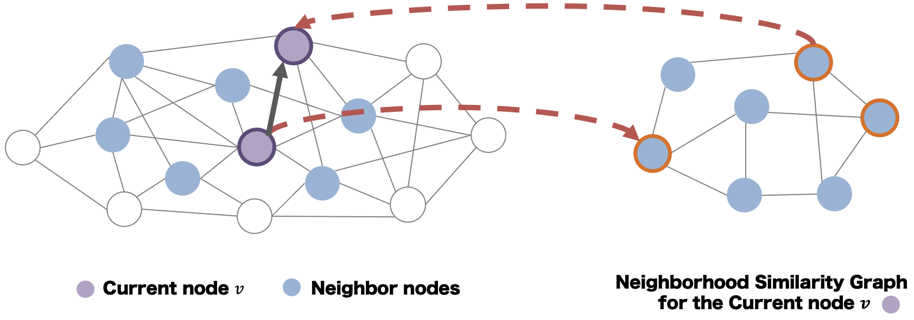

# StarChart
**ManycoreOS Project** This is github repository for StarChart project from Seoul National University.

StarChart is a new graph-based similarity search algorithm for high-dimensional dataset. StarChart is an energy efficient algorithm that achieves lower query processing time and high throughput.

StarChart has MIT license.



### Requirement List
1. Need dataset read wrapper for new dataset

### How to Run
**Set up external library for optimized exection**

Clone external library from https://github.com/greg7mdp/parallel-hashmap which provides excellent hash map implementation. 
```bash
git clone https://github.com/greg7mdp/parallel-hashmap
```
**Setup StarChart**
```bash
git clone https://github.com/oslab-swrc/StarChart
cd StarChart
cp <path to parallel-hashmap>/parallel_hashmap ./src/lib -r
mkdir bin
make ssa
```

***Preprocessing***
```bash
./bin/ssa -s -c <dataset name>
```
Note that \# of threads is hardcoded in `src/manager.c`, please fix it according to your server

***Search***
```bash
./bin/ssa -olblc -c <dataset name>
```

### Example Output
Recall and total latency(ms) are reported as output


### Guide for Developers
`src/code.c`: This is where the main function is, it calls functions for preprocessing and search

`src/manager.c`: Manager maps multiple queries to all threads, manages query results

`src/evaluator.c`: Evaluator runs/saves groundtruth and calculate recall for the queries
