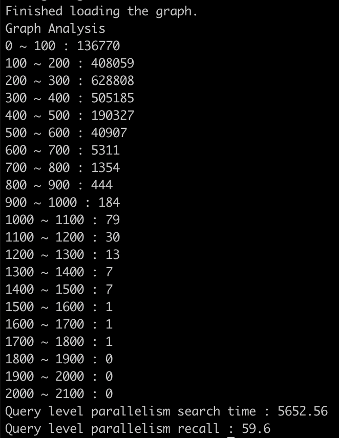

# StarChart
**ManycoreOS Project** This is github repository for StarChart project from Seoul National University.

StarChart is a new graph-based similarity search algorithm for high-dimensional dataset. StarChart is an energy efficient algorithm that achieves lower query processing time and high throughput.

We will update the source code of StarChart when our paper is published.

StarChart has MIT license, `src/lib/parallel_hashmap` is the external library which has Apache License 2.0
### Requirement List
1. Need dataset read wrapper for new dataset
2. Hardcoded \# of threads to utilize

### How to run
```bash
mkdir bin
make ssa
```

### Example output
Recall and total latency(ms) are reported as output


